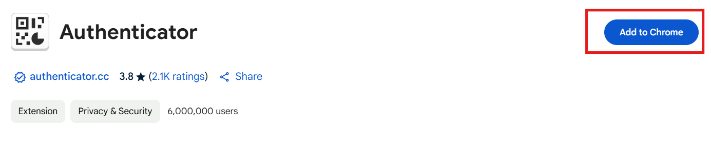
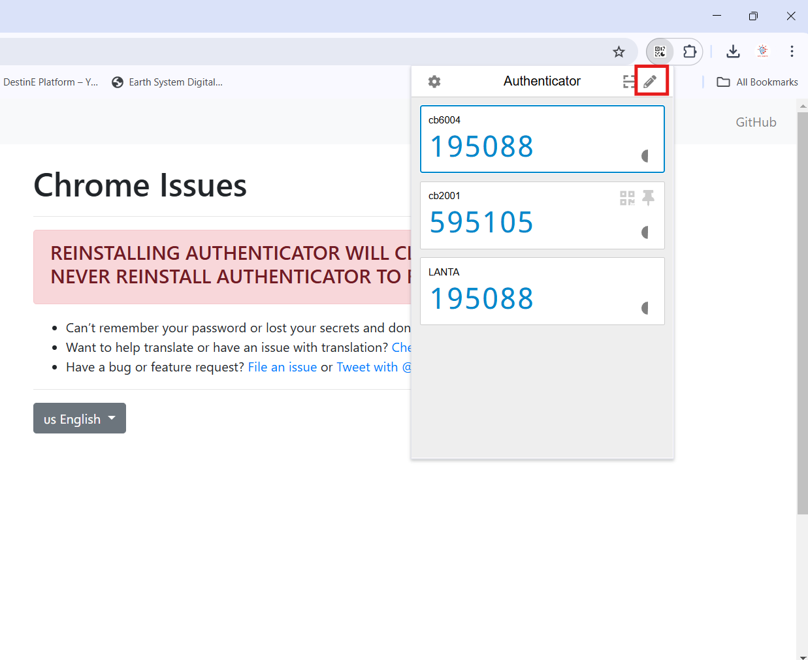
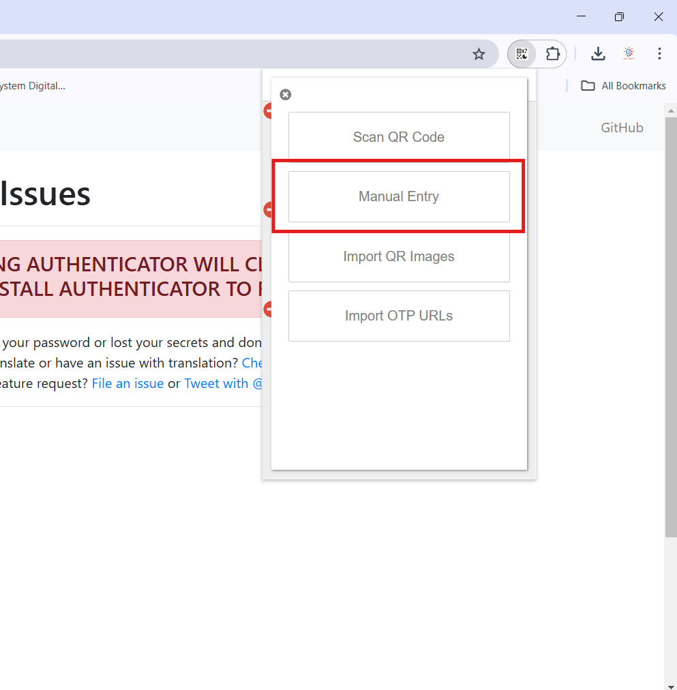
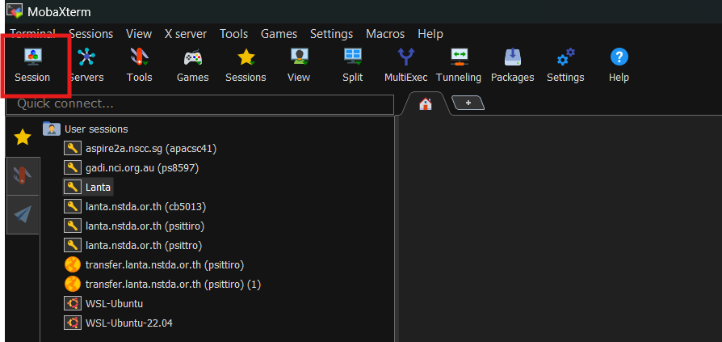
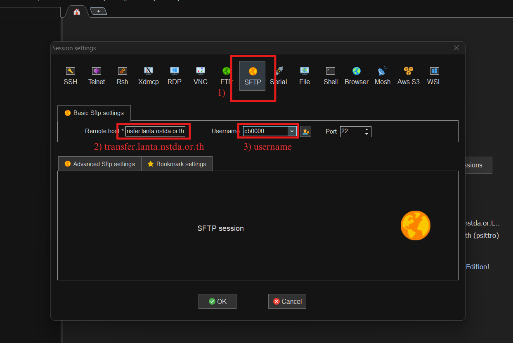
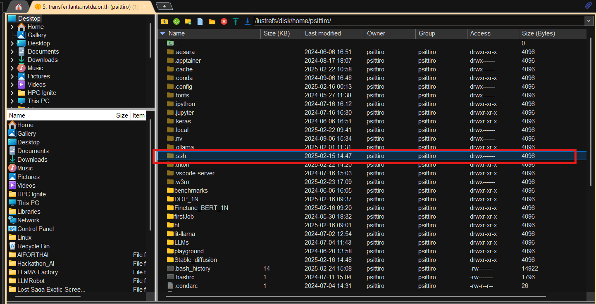
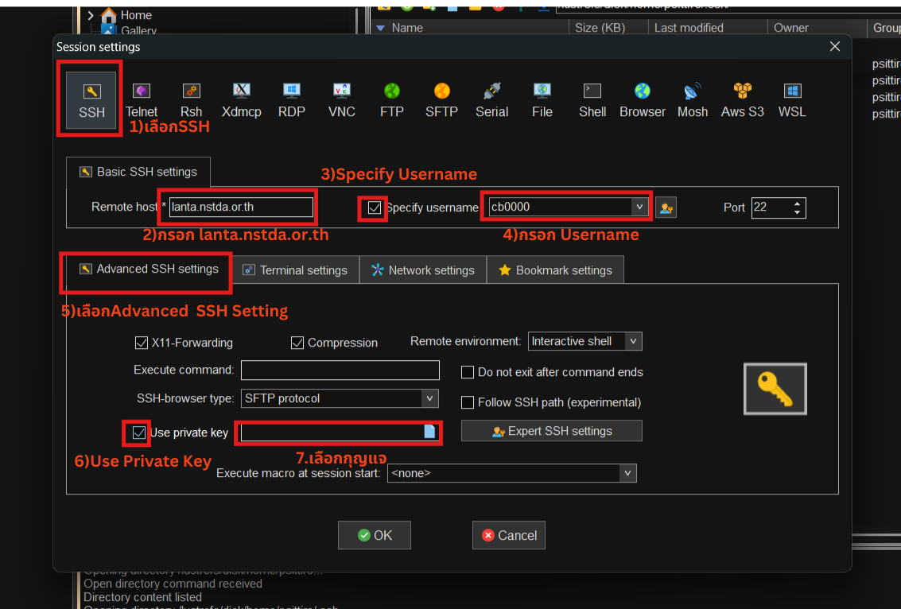

# สไลด์
## https://drive.google.com/drive/folders/19D9uCsV4PEUYyHxLN6IjqhXzalMx0EAO?usp=sharing
## https://www.canva.com/design/DAGnsVjhzWg/ApXqiWXPJ6JoUtVoX6F0Mg/view?utm_content=DAGnsVjhzWg&utm_campaign=designshare&utm_medium=link2&utm_source=uniquelinks&utlId=h75fc95f9f7
## https://www.canva.com/design/DAGdQ57PQCo/NI84rOoEE2RDAI1c_LlcBg/view?utm_content=DAGdQ57PQCo&utm_campaign=designshare&utm_medium=link2&utm_source=uniquelinks&utlId=h8739163ced

# ห้อง Online
https://teams.microsoft.com/l/meetup-join/19:fxWoyABBgWziu-CtDZgdrK8Q7OQbhME-KPnqlaY9DcU1@thread.tacv2/1748399441599?context=%7B%22Tid%22:%220a43deb9-efb0-4f46-8594-71899230fda6%22,%22Oid%22:%22a3bb9828-ad29-408d-8c45-c3864f1f432d%22%7D

# แบบสอบถามก่อนฝึกอบรม
https://forms.gle/tvjDf57jRN4799wBA


# เข้าเครื่อง
## ติดตั้งรหัสยืนยันตัวตน 2FA
ติดตั้ง Authenticator Extension https://chromewebstore.google.com/search/Authenticator

เปิดหน้าต่าง Authenticator และเลือกสร้างแบบ Manual Entry


นำSecret Keyที่ได้รับจากอีเมล์กรอกไปยัง Authenticator แล้วกด Ok

## ใช้โปรแกรม Mobaxterm เพื่อใช้ SFTP เข้าไปหยิบกุญแจ
เข้าโปรแกรม Mobaxterm และเลือกไปที่ session

หลังจากนั้นเลือกไปที่ SFTP และกรอก 
Remotehost: transfer.lanta.nstda.or.th และ Usernameที่อยู่หลังบัตรหรือในอีเมล์ 
หลังจากนั้นกด OK และกรอกPassword และ 2FA ดูจากที่ติตตั้งใน Google Extension

เลือกที่ไปที่ .ssh/

จะพบกับกุญแจ (id_rsa) ให้กดปุ่ม Download ด้านบนเพื่อ Download กุญแจไปยังเครื่อง

## ใช้ กุญแจ เพื่อเข้าใช้เครื่องผ่าน ssh session ใน Mobaxterm
เลือกสร้าง session และกดไปที่ SSH
lanta.nstda.or.th



# โปรแกรมที่ใช้ฝึกอบรม
https://github.com/wdiazcarballo/hpc

# ระหว่างรอ
เว็บไซต์สำหรับเรียนรู้คำสั่งพื้นฐานของระบบปฏิบัติการลีนุกซ์
https://tryhackme.com/room/linuxfundamentalspart1 และ 
https://linuxsurvival.com/

เว็บไซต์ที่จะจัดอันดับเครื่องซูเปอร์คอมพิวเตอร์ที่เร็วที่สุด 500 เครื่อง https://top500.org/
ภาพ 3มิติ ของ HPE-Cray Supercomputer https://www.hpe.com/us/en/product-catalog/3d-model/servers/hpe-cray-systems/hpe-cray-supercomputers/hpe-cray-supercomputer-ex.html

 

เว็บไซต์ที่แสดงข้อมูลของเครื่อง LANTA https://thaisc.io/th/thaisc-resorces/lanta

เว็บไซต์ที่รวบรวมคู่มือการใช้งานเครื่อง LANTA https://thaisc.atlassian.net/wiki/spaces/LANTA/overview?homepageId=230719694#Introduction-to-LANTA

เว็บไซต์ที่แสดงรายละเอียดค่าบริการของเครื่อง LANTA https://thaisc.io/th/access-to-hpc/pricing

ข้อมูลมีมูลค่า -> ตัวอย่างตลาดขาย Dataset https://aws.amazon.com/marketplace/search/results?prevFilters=%257B%2522trk%2522%3A%25228384929b-0eb1-4af3-8996-07aa409646bc%2522%2C%2522sc_channel%2522%3A%2522el%2522%2C%2522FULFILLMENT_OPTION_TYPE%2522%3A%2522DATA_EXCHANGE%2522%2C%2522CONTRACT_TYPE%2522%3A%2522OPEN_DATA_LICENSES%2522%2C%2522filters%2522%3A%2522FULFILLMENT_OPTION_TYPE%2CCONTRACT_TYPE%2522%257D&searchTerms=Thailand


# ซูเปอร์คอมพิวเตอร์ ที่น่าสนใจ
## ฟูกากุ เครื่องที่ผลิตชิปและระบบเฉพาะขึ้นมาเอง
https://www.r-ccs.riken.jp/en/fugaku/3d-models/
## El Captain เครื่องซูเปอร์คอมพิวเตอร์ที่เร็วที่สุดในโลก พย.2024
https://www.youtube.com/watch?v=Q8wtuk3XPWM
## เครื่อง Frontier (สหรัฐอเมริกา)
https://www.olcf.ornl.gov/olcf-resources/compute-systems/frontier/
## ซูเปอร์คอมพิวเตอร์ ใน Europe
https://eurohpc-ju.europa.eu/supercomputers/our-supercomputers_en
## เครื่องที่เร็วสุดใน Asia: Aspire2A+
https://www.nscc.sg/aspire-2a-plus/
## ซูเปอร์คอมพิวเตอร์ของ Australia 
https://nci.org.au/our-systems/hpc-systems
## ซูเปอร์คอมพิวเตอร์ ของไต้หวัน (Taiwania3)
https://www.nchc.org.tw/

## น่าจับตามอง Brazil
https://www.datacenterdynamics.com/en/news/brazils-petrobras-has-purchased-89-million-fleet-of-lenovo-supercomputers/

# คำสั่งสำหรับใช้ Nano และ Tree
```bash
module use /project/cb900907-hpctgn/modules
```
```bash
module load nano
```

```bash
module load tree
```

# ฝึกเล่น หรือ ใช้สอน
- ทดลองสร้าง Neuron network model สำหรับการจำแนก https://playground.tensorflow.org/
- แบบจำลองเพื่อการเรียนวิทยาศาสตร์ https://phet.colorado.edu/
- สร้างโมเดล Machine Learning ของตัวเอง https://teachablemachine.withgoogle.com/

# ตัวอย่างการใช้งาน Supercomputer
## ด้านวิทยาศาสตร์ธรรมชาติ Life Science
- GISAID (Global Initiative on Sharing All Influenza Data) คือโครงการระดับนานาชาติที่มุ่งเน้นการแบ่งปันข้อมูลทางพันธุกรรมของไวรัสไข้หวัดใหญ่ (Influenza) และไวรัสอื่น ๆ ที่เกี่ยวข้อง เช่น ไวรัสโคโรนา (SARS-CoV-2) เพื่อส่งเสริมความร่วมมือด้านการวิจัยและการเฝ้าระวังโรคระบาดทั่วโลก https://gisaid.org/
- HADDOCK (High Ambiguity Driven biomolecular DOCKing) เป็นซอฟต์แวร์สำหรับการจำลองการจับคู่ของโมเลกุลชีวภาพ โดยใช้ข้อมูลทางชีวเคมีหรือชีวฟิสิกส์เป็นแนวทาง เวอร์ชัน 2.2 เปิดตัวในเดือนมีนาคม พ.ศ. 2558 https://www.bonvinlab.org/software/haddock2.2/

## วิทยาศาสตร์โลก Earth Science 
- ความยั่งยืนของโลก https://insights.sustainability.google
- โมเดลโลกจากไมโครซอฟต์ https://www.microsoft.com/en-us/research/product/microsoft-premonition/
-  Climate Model: https://fluid-earth.byrd.osu.edu/
- Weather Model: [Windy.com](https://www.windy.com/?13.805,100.675,5)
- Air Quality Model: https://www.microsoft.com/en-us/research/product/microsoft-premonition/


## งานคำนวณเร่งด่วน Urgent Computing
- ภัยพิบัติ ( Disaster Prediction) https://www.pdc.org/
  
# แบบสอบถามหลังฝึกอบรม
https://forms.gle/tK9vmbtVmDc7PQqq8

# ข้อมูลมีค่า
https://aws.amazon.com/marketplace/search/results?prevFilters=%257B%2522trk%2522%3A%25228384929b-0eb1-4af3-8996-07aa409646bc%2522%2C%2522sc_channel%2522%3A%2522el%2522%2C%2522FULFILLMENT_OPTION_TYPE%2522%3A%2522DATA_EXCHANGE%2522%2C%2522CONTRACT_TYPE%2522%3A%2522OPEN_DATA_LICENSES%2522%2C%2522filters%2522%3A%2522FULFILLMENT_OPTION_TYPE%2CCONTRACT_TYPE%2522%257D&searchTerms=Thailand


